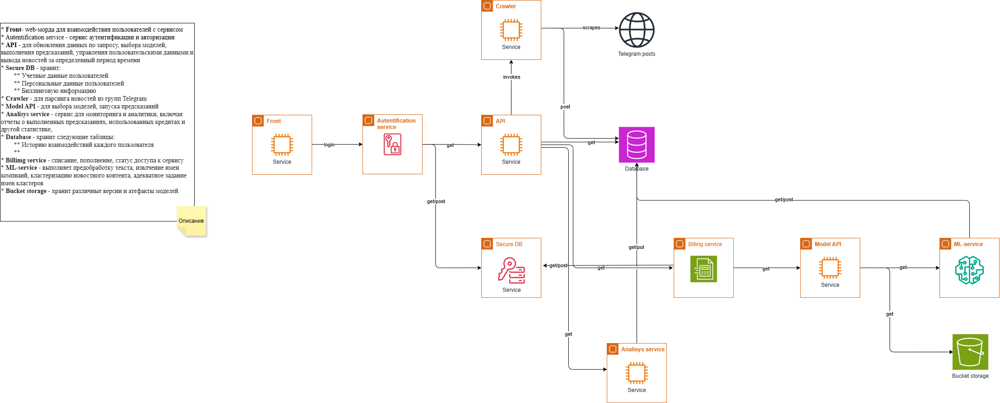

# Термины и пояснения

- **БТ** - бизнес-требования
- **EDA** - Exploratory Data Analysis - исследовательский анализ данных

# 1. Цели и предпосылки

Автоматическое объединение компаний в кластеры на основе новостных данных. Система анализирует новостные источники, выявляет упоминания компаний и группирует их по контекстуальной близости. Каждому кластеру присваивается информативное название, отражающее общую тематику. Пользователи могут выбирать период новостного охвата для анализа (день, неделя, месяц или произвольный период). Решение помогает бизнес-аналитикам быстро выявлять рыночные тренды, отслеживать конкурентов и находить потенциальных партнеров в схожих сферах деятельности.

## 1.1. Зачем идем в разработку продукта?

### Бизнес-цели:

- Получение визуальной информации о присоединении компании к трендам за период времени
- Дальнейший бизнес-анализ появления или наличия конкурентов на рынке
- Анализ поведения компаний-конкурентов
- Анализ трендов рынка

### Проблематика:

- Отсутствие похожего инструмента на рынке
- Сложный анализ новостного контента для поиска трендов
- Сложная привязка компаний к трендам за период времени

### Преимущества использования ИИ:

- Автоматический поиск наиболее близких тем, в которых упоминаются компании
- Быстрота поиска и визуализации
- Снижение затрат на содержание сотрудников по бизнес-анализу
- Доступность

## 1.2. Бизнес-требования и ограничения:

### Требования:

- Автоматическое объединение компаний в кластера на основе новостных данных
- Адекватное наименование кластеров
- Возможность выбора периода новостного охвата

### Ограничения:

- Краткие сроки на разработку
- Использование GPU Nvidia 3090 x1

## 1.3. Итерации проекта:
- PoC - Прототипирование функционала в Jupyter Notebooks
    - Парсинг новостей из групп в Telegram, использование сторонних источников
    - Очистка и преобразование текста
    - Поиск наименований компаний в новостях
    - Кластеризация компаний по содержимому новостей
    - Качество кластеризации на минимальном уровне
    - Решение полностью воспроизводимо при последовательном запуске ячеек
- MVP - тестирование в контролируемой среде:
    - Улучшение алгоритмов очистки и преобразования текста
    - Исследование и улучшение оптимальных алгоритмов кластеризации текста
    - Исследование и реализация наилучшего способа задания имени кластера
    - Добавление возможности фильтрации по временному периоду

## 1.4. Предпосылки решения:
Запрос от стартапа SOLID

# 2. Методология

## 2.1. Постановка задачи:
Автоматическое объединение компаний в кластеры на основе новостных данных. Система анализирует новостные источники, выявляет упоминания компаний и группирует их по контекстуальной близости. Каждому кластеру присваивается информативное название, отражающее общую тематику. Пользователи могут выбирать период новостного охвата для анализа (день, неделя, месяц или произвольный период).

## 2.2. Блок-схема решения:

## 2.3. Этапы работы над проектом

### Этап 1. Подготовка данных
**Полное EDA см. в `notebooks\DCMML_hw_2.ipynb`**
- Данные представляеют собой объекты, содержащие поля `["text", "date", "source", "url"]`. К выявленным проблемам можно отнести периодические необъясненные пропуски в значении поля `"text"`.
- В настоящий момент данные поступают из Telegram-канала `forbes/russia` и сайта `https://lenta.ru/`. Из `forbes/russia` новости поступают за последние 21 день, из `https://lenta.ru/` за сутки. Формат пока не регулярный.
- Данные ожидается парсить за последний месяц, необходимо интегрировать планировщик в существующий пайплайн.
- Конфиденциальной информации в данных нет
- По окончании работы данного этапа имеются текстовые данные, очищенные от неинформативных сущностей (ссылки, html-элементы, эмодзи, знаки препинания), оформленные в виде csv-файлов.

### Этап 2. Подготовка прогнозных моделей
- Данная задача относится к задаче тематического моделирования (Topic Modeling).
- Были выбраны следующие метрики: 
  - Topic Diversity
  - UMass Coherence Hint
- Функции потерь для каждого из этапов Topic Modeling подбираются как гиперпараметры и требуют проведения экспериментов.
- Бейзлайн выглядит следующим образом:
  - Разбиение текстов на токены и преобразование в эмбеддинги с помощью модели `"deepvk/USER2-base"`.
  - Эффективаное снижение размерности векторов с применением алгоритма `UMAP(n_neighbors=15, n_components=100, min_dist=0.0, metric='euclidean')`
  - Кластеризация с помощью `HDBSCAN(min_cluster_size=15, metric='euclidean', cluster_selection_method='eom', prediction_data=True)`
  - Модель векторизации документов для поиска частотных слов - `CountVectorizer` с использованием стоп-слов для русского языка
  - Модель для получения репрезентативных документов на основе частотных слова - `ClassTfidfTransformer(reduce_frequent_words=True)`
  - Модель для получения репрезентативных заголовков кластеров - `keybert.KeyBERT(model=embedding_model)`
- Стратегии дальнейшего развития:
  - Настройка гиперпараметров выбранных элементов бейзлайна
  - Подбор различных компонентов:
    - Моделей для получения эмбеддингов. Можно сравнить модели по размеру или по мультиязычности, по бенчмаркам и прочее.
    - Моделей снижения размерности. Тот же LDA
    - Моделей кластеризации. Тот же KMeans
    - `CountVectorizer` заменить на `TfIdfVectorizer`
    - Моделей для получения репрезентативных заголовков кластеров. Тут даже можно фремворки разнвые попробовать использовать.
- Анализ работы модели можно получить исходя из метрик. Интерпретацию из наглядного получения распределения и наименований кластеров.
- Риски этапа
  - Вычислительное время. Необходимо минимальными эврестическими правилами эффективно подбирать компоненты системы во время проверки гипотез о производительности.
  - Нет метрики для оценки качества присвоенных имен кластерам. Данная задача является критически важной.
- Необходимый результат этапа - выбраны и загружены все необходимые компоненты пайплайна Topic Modeling, эффективно подобраны гиперпараметры моделей, выбрана лучшая конфигурация моделей, при которой кластера и их наименования интерпретируются удовлетворительно. 
- Бизнес-проверка результата этапа однозначно необходима т.к. метрики не способны покрыть все стороны оценки качества системы. Возможно применения AB-тестирования, где часть клиентов получит систему до изменения ее конфигурации, часть - после, далее будет проведена проверка отношения довольных клиентов.

# 3. Подготовка пилота

# 4. Внедрение

## 4.1. Архитектура решения

## 4.2. Описание инфраструктуры и масштабируемости

## 4.3. Требования к работе системы

### 4.3.1. Бизнес-требование

- Возможность загрузки и использования ML-моделей: сервис должен иметь возможность загружать и использовать различные ML-модели для выполнения кластеризации. Входные данные для моделей должны подаваться в сервис с использованием удобного API (Application Programming Interface).
- Биллинговая подсистема: сервис должен поддерживать функциональность биллинга, где пользователь хранит определенное количество кредитов на своем личном счете. При успешном выполнении предсказания, счет пользователя должен быть списан за использованные кредиты.
- Пользовательская система: сервис должен иметь пользовательский интерфейс, позволяющий пользователям регистрироваться, входить в систему и управлять своим личным счетом
- Мониторинг и аналитика: сервис должен предоставлять возможность мониторинга и аналитики, включая отчеты о выполненных предсказаниях, использованных кредитах и другой статистике.

### 4.3.2. Технические требования

#### 4.3.2.1. Функциональные:
- Сервис должен обеспечивать автоматическую кластеризацию компаний на основе новостных данных
- Система должна корректно определять и извлекать названия компаний из новостных текстов
- Алгоритм кластеризации должен группировать компании по релевантности их упоминания в схожих новостных контекстах
- Каждому кластеру должно автоматически присваиваться информативное и понятное название
- Пользователи должны иметь возможность фильтровать результаты по временному периоду (день, неделя, месяц, произвольный период)
- API должен поддерживать запросы на получение кластеров с различными параметрами фильтрации
- Система должна обрабатывать запросы в асинхронном режиме с возможностью получения статуса выполнения
- Результаты кластеризации должны предоставляться в структурированном формате (JSON)
- Сервис должен обеспечивать кэширование результатов для повторных запросов с одинаковыми параметрами
- Должна быть реализована система логирования всех этапов обработки данных для отладки и мониторинга
- Интерфейс должен предоставлять визуализацию кластеров в удобном для восприятия виде
- Система должна масштабироваться для обработки растущего объема новостных данных

#### 4.3.2.1. Нефункциональные:
- Производительность:
  - Система должна обрабатывать до 1000 запросов в минуту
  - Время отклика API не должно превышать 500 мс для стандартных запросов
  - Полная обработка и кластеризация новостного потока за последние 24 часа должна выполняться не более 10 минут
  - Система должна поддерживать параллельную обработку минимум 50 одновременных запросов

- Надежность и доступность:
  - Доступность сервиса должна составлять не менее 99.9% (допустимое время простоя не более 8.76 часов в год)
  - Система должна автоматически восстанавливаться после сбоев
  - Регулярное резервное копирование данных с возможностью восстановления до состояния не старше 1 часа

- Масштабируемость:
  - Горизонтальное масштабирование для обработки увеличения нагрузки до 5000 запросов в минуту
  - Вертикальное масштабирование для обработки более сложных алгоритмов кластеризации
  - Система должна эффективно работать с объемом данных до 10 ТБ

- Безопасность:
  - Шифрование всех данных при передаче (TLS 1.3+)
  - Шифрование чувствительных данных при хранении
  - Аутентификация пользователей с использованием JWT-токенов
  - Авторизация доступа к API на основе ролей
  - Защита от основных типов атак (OWASP Top 10)

- Совместимость:
  - API должно соответствовать спецификации OpenAPI 3.0
  - Поддержка интеграции с популярными системами мониторинга (Prometheus, Grafana)
  - Совместимость с основными облачными провайдерами (AWS, GCP, Azure)

- Удобство использования:
  - Интуитивно понятный пользовательский интерфейс
  - Документация API с примерами использования
  - Время обучения новых пользователей не должно превышать 2 часа

- Поддерживаемость:s
  - Модульная архитектура для упрощения обновлений и расширений
  - Полное покрытие кода тестами (не менее 80%)
  - Автоматизированный процесс развертывания (CI/CD)
  - Подробное логирование для диагностики проблем

## 4.4. Безопасность системы

## 4.5. Безопасность данных

## 4.6. Издержки

## 4.5. Integration points

## 4.6. Риски
