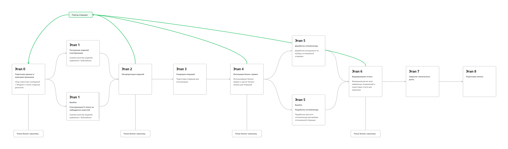
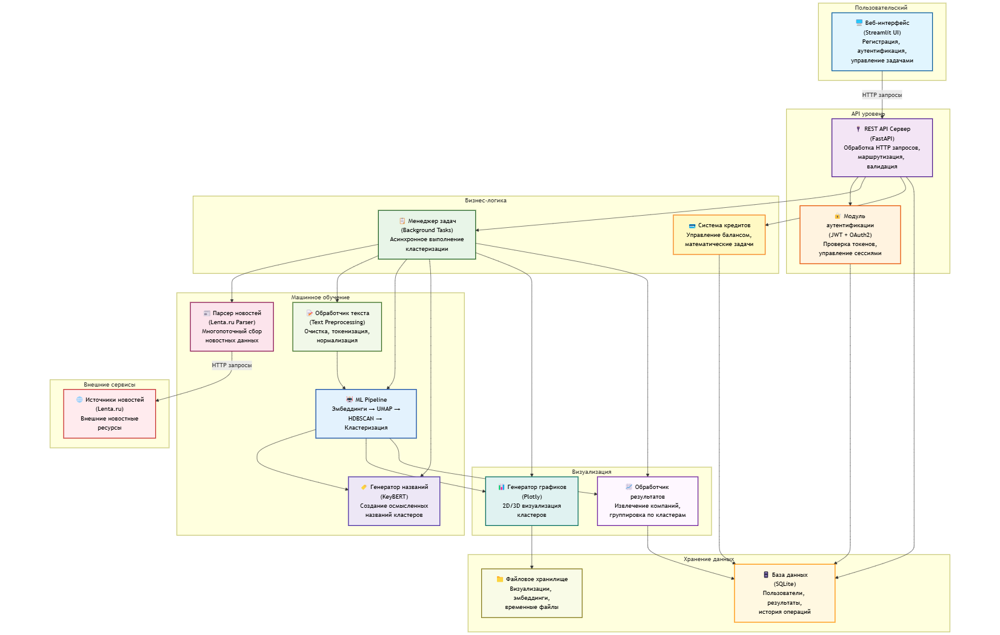

# Термины и пояснения

- **БТ** - бизнес-требования
- **EDA** - Exploratory Data Analysis - исследовательский анализ данных

# 1. Цели и предпосылки

Автоматическое объединение компаний в кластеры на основе новостных данных. Система анализирует новостные источники, выявляет упоминания компаний и группирует их по контекстуальной близости. Каждому кластеру присваивается информативное название, отражающее общую тематику. Пользователи могут выбирать период новостного охвата для анализа (день, неделя, месяц или произвольный период). Решение помогает бизнес-аналитикам быстро выявлять рыночные тренды, отслеживать конкурентов и находить потенциальных партнеров в схожих сферах деятельности.

## 1.1. Зачем идем в разработку продукта?

### Бизнес-цели:

- Получение визуальной информации о присоединении компании к трендам за период времени
- Дальнейший бизнес-анализ появления или наличия конкурентов на рынке
- Анализ поведения компаний-конкурентов
- Анализ трендов рынка

### Проблематика:

- Отсутствие похожего инструмента на рынке
- Сложный анализ новостного контента для поиска трендов
- Сложная привязка компаний к трендам за период времени

### Преимущества использования ИИ:

- Автоматический поиск наиболее близких тем, в которых упоминаются компании
- Быстрота поиска и визуализации
- Снижение затрат на содержание сотрудников по бизнес-анализу
- Доступность

## 1.2. Бизнес-требования и ограничения:

### Требования:

- Автоматическое объединение компаний в кластера на основе новостных данных
- Адекватное наименование кластеров
- Возможность выбора периода новостного охвата

### Ограничения:

- Краткие сроки на разработку
- Использование GPU Nvidia 3090 x1

## 1.3. Итерации проекта:
- PoC - Прототипирование функционала в Jupyter Notebooks
    - Парсинг новостей из групп в Telegram, использование сторонних источников
    - Очистка и преобразование текста
    - Поиск наименований компаний в новостях
    - Кластеризация компаний по содержимому новостей
    - Качество кластеризации на минимальном уровне
    - Решение полностью воспроизводимо при последовательном запуске ячеек
- MVP - тестирование в контролируемой среде:
    - Улучшение алгоритмов очистки и преобразования текста
    - Исследование и улучшение оптимальных алгоритмов кластеризации текста
    - Исследование и реализация наилучшего способа задания имени кластера
    - Добавление возможности фильтрации по временному периоду

## 1.4. Предпосылки решения:
Запрос от стартапа SOLID

# 2. Методология

## 2.1. Постановка задачи:
Автоматическое объединение компаний в кластеры на основе новостных данных. Система анализирует новостные источники, выявляет упоминания компаний и группирует их по контекстуальной близости на основе инфоповода. Каждому кластеру присваивается информативное название, отражающее общую тематику инфоповода. Пользователи могут выбирать период новостного охвата для анализа (день, неделя, месяц или произвольный период).

## 2.2. Блок-схема решения:

## 2.3. Этапы работы над проектом

### Этап 1. Подготовка данных
**Полное EDA см. в `notebooks\DCMML_hw_2.ipynb`**
- Данные представляеют собой объекты, содержащие поля `["text", "date", "source", "url"]`. К выявленным проблемам можно отнести периодические необъясненные пропуски в значении поля `"text"`.
- В настоящий момент данные поступают из Telegram-канала `forbes/russia` и сайта `https://lenta.ru/`. Из `forbes/russia` новости поступают за последние 21 день, из `https://lenta.ru/` за сутки. Формат пока не регулярный.
- Данные ожидается парсить за последний месяц, необходимо интегрировать планировщик в существующий пайплайн.
- Конфиденциальной информации в данных нет
- По окончании работы данного этапа имеются текстовые данные, очищенные от неинформативных сущностей (ссылки, html-элементы, эмодзи, знаки препинания), оформленные в виде csv-файлов.

### Этап 2. Подготовка прогнозных моделей
- Данная задача относится к задаче тематического моделирования (Topic Modeling).
- Были выбраны следующие метрики:
  - CV Coherence
  - Silhouette Score
  - Davies-Bouldin Index
  - Calinski-Harabasz Index
- Функции потерь для каждого из этапов Topic Modeling подбираются как гиперпараметры и требуют проведения экспериментов.
- Бейзлайн выглядит следующим образом:
  - Разбиение текстов на токены и преобразование в эмбеддинги с помощью модели `"deepvk/USER2-base"`.
  - Эффективаное снижение размерности векторов с применением алгоритма `UMAP(n_neighbors=15, n_components=100, min_dist=0.0, metric='euclidean')`
  - Кластеризация с помощью `HDBSCAN(min_cluster_size=15, metric='euclidean', cluster_selection_method='eom', prediction_data=True)`
  - Модель векторизации документов для поиска частотных слов - `CountVectorizer` с использованием стоп-слов для русского языка
  - Модель для получения репрезентативных документов на основе частотных слова - `ClassTfidfTransformer(reduce_frequent_words=True)`
  - Модель для получения репрезентативных заголовков кластеров - `keybert.KeyBERT(model=embedding_model)`

#### Результаты оценки обученной модели:
- **Количество обнаруженных тем:** 34
- **Покрытие данных:** 77.2% (доля выбросов 22.8%)
- **Качество кластеризации:**
  - Silhouette Score: 0.060 (низкое качество разделения кластеров)
  - Calinski-Harabasz Score: 12.34 (отношение межгрупповой/внутригрупповой дисперсии)
  - Davies-Bouldin Score: 2.34 (высокая схожесть между кластерами)
- **Качество тем:**
  - Средняя CV Coherence: 0.92 (высокая семантическая связность)
  - Уникальность слов в темах: 96.8%
  - Средний размер темы: 20.2 документа
- **Распределение тем:**
  - Энтропия: 4.47 (относительно равномерное распределение)
  - Коэффициент Джини: 0.45 (умеренная неравномерность)

- Стратегии дальнейшего развития:
  - Улучшение качества кластеризации за счет настройки гиперпараметров HDBSCAN
  - Снижение доли выбросов путем корректировки параметров min_cluster_size
  - Подбор различных компонентов:
    - Моделей для получения эмбеддингов. Можно сравнить модели по размеру или по мультиязычности, по бенчмаркам и прочее.
    - Моделей снижения размерности. Тот же LDA
    - Моделей кластеризации. Тот же KMeans
    - `CountVectorizer` заменить на `TfIdfVectorizer`
    - Моделей для получения репрезентативных заголовков кластеров. Тут даже можно фремворки разнвые попробовать использовать.
    - Исользование можности API LLM в качестве создания эмбеддингов и формулировки имени кластеров.
- Анализ работы модели можно получить исходя из метрик. Интерпретацию из наглядного получения распределения и наименований кластеров.
- Риски этапа
  - Низкое качество кластеризации требует дополнительной оптимизации
  - Высокая доля выбросов снижает покрытие данных
  - Необходимо улучшение алгоритма для повышения разделимости кластеров.
- Необходимый результат этапа - выбраны и загружены все необходимые компоненты пайплайна Topic Modeling, эффективно подобраны гиперпараметры моделей, выбрана лучшая конфигурация моделей, при которой кластера и их наименования интерпретируются удовлетворительно.
- Бизнес-проверка результата этапа однозначно необходима т.к. метрики не способны покрыть все стороны оценки качества системы. Возможно применения AB-тестирования, где часть клиентов получит систему до изменения ее конфигурации, часть - после, далее будет проведена проверка отношения довольных клиентов.

# 3. Внедрение

## 3.1. Архитектура решения

## 3.2. Описание инфраструктуры и масштабируемости

### Архитектура развертывания

Система развертывается в облачной инфраструктуре с использованием контейнеризации и оркестрации для обеспечения масштабируемости и надежности.

**Базовые компоненты:**
- **API Gateway**: FastAPI сервер для обработки HTTP-запросов и управления API
- **Веб-интерфейс**: Streamlit приложение для пользовательского взаимодействия
- **База данных**: SQLite для разработки, PostgreSQL для продакшена
- **Файловое хранилище**: S3-совместимое хранилище для визуализаций и моделей
- **Очередь задач**: Redis для управления фоновыми задачами кластеризации
- **Мониторинг**: Prometheus + Grafana для метрик производительности

### Стратегия масштабирования

**Горизонтальное масштабирование:**
- Автоматическое масштабирование API сервисов на основе нагрузки CPU/памяти
- Балансировка нагрузки между несколькими экземплярами приложения
- Репликация базы данных для чтения с master-slave конфигурацией
- Кэширование часто запрашиваемых результатов через Redis

**Вертикальное масштабирование:**
- Выделенные вычислительные ресурсы для ML-операций с GPU
- Динамическое выделение памяти для обработки больших датасетов
- Оптимизация моделей машинного обучения для эффективного использования ресурсов

### Управление состоянием и развертывание

**Infrastructure as Code (IaC):**
- Terraform для управления облачными ресурсами
- Kubernetes для оркестрации контейнеров
- GitOps подход для автоматического развертывания изменений

**CI/CD Pipeline:**
- Автоматическое тестирование при каждом коммите
- Поэтапное развертывание через staging/production среды
- Автоматический rollback при обнаружении критических ошибок

### Безопасность и отказоустойчивость

**Меры безопасности:**
- JWT-аутентификация с ротацией токенов
- HTTPS/TLS шифрование для всех соединений
- Сетевая изоляция компонентов через VPC
- Регулярное резервное копирование данных

**Обеспечение доступности:**
- Multi-AZ развертывание для критически важных компонентов
- Health checks и автоматический перезапуск неисправных сервисов
- Circuit breaker паттерн для внешних API вызовов
- Graceful degradation при недоступности отдельных компонентов

### Мониторинг и наблюдаемость

**Ключевые метрики:**
- Время отклика API и пропускная способность
- Использование ресурсов (CPU, память, сеть, диск)
- Частота ошибок и успешность операций кластеризации
- Биллинговые метрики и потребление кредитов пользователями

**Алертинг:**
- Уведомления при превышении лимитов ответного времени
- Мониторинг доступности критических сервисов
- Контроль использования ресурсов и автоматическое масштабирование

## 3.3. Требования к работе системы

### 3.3.1. Требования к быстродействию

**Время отклика системы:**
- API-запросы на получение статуса задачи: не более 100 мс
- API-запросы на получение результатов кластеризации: не более 500 мс
- Веб-интерфейс: загрузка страниц не более 2 секунд
- Создание новой задачи кластеризации: не более 1 секунды

**Пропускная способность:**
- Минимум 1000 API-запросов в минуту в обычном режиме
- Пиковая нагрузка до 5000 запросов в минуту
- Одновременная обработка до 50 задач кластеризации
- Поддержка 100+ одновременных пользователей веб-интерфейса

**Производительность ML-операций:**
- Парсинг новостей за 24 часа: не более 5 минут
- Кластеризация 1000 новостей: не более 3 минут
- Генерация названий кластеров: не более 30 секунд
- Создание визуализации: не более 10 секунд

### 3.3.2. Требования к надежности

**Доступность сервиса (SLA):**
- Основные API-эндпоинты: 99.9% (8.76 часов простоя в год)
- Веб-интерфейс: 99.5% (43.8 часов простоя в год)
- ML-сервисы кластеризации: 99.0% (87.6 часов простоя в год)
- Система мониторинга: 99.95% (4.38 часов простоя в год)

**Восстановление после сбоев:**
- Автоматический перезапуск упавших сервисов: не более 30 секунд
- Восстановление базы данных из резервной копии: не более 15 минут
- Переключение на резервный экземпляр: не более 2 минут
- Полное восстановление системы после катастрофы: не более 4 часов

**Отказоустойчивость:**
- Репликация базы данных на 2+ узлах
- Резервное копирование каждые 6 часов с хранением 30 дней
- Circuit breaker для внешних API с таймаутом 10 секунд
- Graceful degradation при недоступности ML-компонентов

### 3.3.3. Способы масштабирования сервиса

**Горизонтальное масштабирование:**
- Автоматическое масштабирование API-сервисов (2-20 экземпляров)
- Масштабирование по метрикам CPU > 70% или RAM > 80%
- Балансировка нагрузки с Round Robin + Health Checks
- Репликация read-only баз данных для снижения нагрузки

**Вертикальное масштабирование:**
- Динамическое выделение ресурсов для ML-задач
- GPU-ускорение для операций с эмбеддингами
- Увеличение RAM для обработки больших датасетов
- SSD-диски для ускорения операций I/O

**Кэширование и оптимизация:**
- Redis-кэш для API-ответов (TTL 1 час)
- Кэширование эмбеддингов на 24 часа
- CDN для статических ресурсов веб-интерфейса
- Сжатие данных при передаче (gzip)

**Асинхронная обработка:**
- Очередь задач через Redis/RabbitMQ
- Background workers для ML-операций
- Неблокирующие API для длительных операций
- Batch-обработка новостей по расписанию

**Infrastructure as Code для масштабирования:**
- Terraform для автоматического управления ресурсами
- Kubernetes для оркестрации контейнеров и автоскейлинга
- Helm charts для развертывания микросервисов
- GitOps для автоматизации процесса развертывания изменений

**Мониторинг производительности:**
- Алерты при превышении времени отклика > 1 секунды
- Мониторинг использования ресурсов в режиме реального времени
- Автоматическое масштабирование при достижении пороговых значений
- Метрики качества ML-моделей для оптимизации производительности

### 3.3.4. Бизнес-требования

- Возможность загрузки и использования ML-моделей: сервис должен иметь возможность загружать и использовать различные ML-модели для выполнения кластеризации. Входные данные для моделей должны подаваться в сервис с использованием удобного API (Application Programming Interface).
- Биллинговая подсистема: сервис должен поддерживать функциональность биллинга, где пользователь хранит определенное количество кредитов на своем личном счете. При успешном выполнении предсказания, счет пользователя должен быть списан за использованные кредиты.
- Пользовательская система: сервис должен иметь пользовательский интерфейс, позволяющий пользователям регистрироваться, входить в систему и управлять своим личным счетом
- Мониторинг и аналитика: сервис должен предоставлять возможность мониторинга и аналитики, включая отчеты о выполненных предсказаниях, использованных кредитах и другой статистике.

### 3.3.5. Технические требования

#### 3.3.5.1. Функциональные:
- Сервис должен обеспечивать автоматическую кластеризацию компаний на основе новостных данных
- Система должна корректно определять и извлекать названия компаний из новостных текстов
- Алгоритм кластеризации должен группировать компании по релевантности их упоминания в схожих новостных контекстах
- Каждому кластеру должно автоматически присваиваться информативное и понятное название
- Пользователи должны иметь возможность фильтровать результаты по временному периоду (день, неделя, месяц, произвольный период)
- API должен поддерживать запросы на получение кластеров с различными параметрами фильтрации
- Система должна обрабатывать запросы в асинхронном режиме с возможностью получения статуса выполнения
- Результаты кластеризации должны предоставляться в структурированном формате (JSON)
- Сервис должен обеспечивать кэширование результатов для повторных запросов с одинаковыми параметрами
- Должна быть реализована система логирования всех этапов обработки данных для отладки и мониторинга
- Интерфейс должен предоставлять визуализацию кластеров в удобном для восприятия виде
- Система должна масштабироваться для обработки растущего объема новостных данных

#### 3.3.5.2. Нефункциональные:
- Производительность:
  - Система должна обрабатывать до 1000 запросов в минуту
  - Время отклика API не должно превышать 500 мс для стандартных запросов
  - Полная обработка и кластеризация новостного потока за последние 24 часа должна выполняться не более 10 минут
  - Система должна поддерживать параллельную обработку минимум 50 одновременных запросов

- Надежность и доступность:
  - Доступность сервиса должна составлять не менее 99.9% (допустимое время простоя не более 8.76 часов в год)
  - Система должна автоматически восстанавливаться после сбоев
  - Регулярное резервное копирование данных с возможностью восстановления до состояния не старше 1 часа

- Масштабируемость:
  - Горизонтальное масштабирование для обработки увеличения нагрузки до 5000 запросов в минуту
  - Вертикальное масштабирование для обработки более сложных алгоритмов кластеризации
  - Система должна эффективно работать с объемом данных до 10 ТБ

- Безопасность:
  - Шифрование всех данных при передаче (TLS 1.3+)
  - Шифрование чувствительных данных при хранении
  - Аутентификация пользователей с использованием JWT-токенов
  - Авторизация доступа к API на основе ролей
  - Защита от основных типов атак (OWASP Top 10)

- Совместимость:
  - API должно соответствовать спецификации OpenAPI 3.0
  - Поддержка интеграции с популярными системами мониторинга (Prometheus, Grafana)
  - Совместимость с основными облачными провайдерами (AWS, GCP, Azure)

- Удобство использования:
  - Интуитивно понятный пользовательский интерфейс
  - Документация API с примерами использования
  - Время обучения новых пользователей не должно превышать 2 часа

- Поддерживаемость:
  - Модульная архитектура для упрощения обновлений и расширений
  - Полное покрытие кода тестами (не менее 80%)
  - Автоматизированный процесс развертывания (CI/CD)
  - Подробное логирование для диагностики проблем

## 4.4. Безопасность системы

## 4.5. Безопасность данных

## 4.6. Издержки

## 4.5. Integration points

## 4.6. Риски
